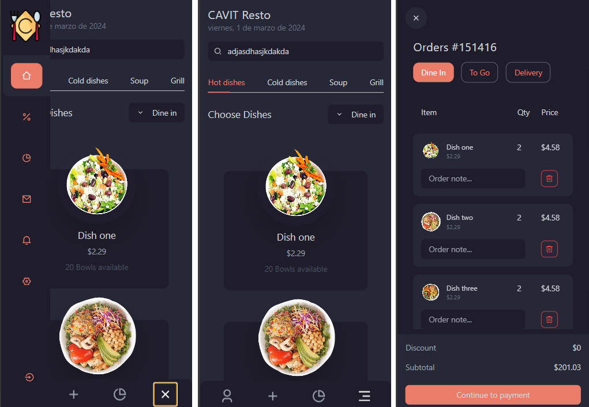

## <a name="visit-page">🌟 Visit the page</a>

🔴 I haven't published it yet..

## <a name="tech-stack">⚙️ Tech Stack</a>

- React.js
- Tailwind CSS

## <a name="features">🔋 Features</a>

👉 **IMPORTANT**:The project is not finished, more features can be added in the future.

👉 **Modern User Interface**: A modern and user-friendly interface, offering an intuitive experience for users.

👉 **Home**: The application has a main menu where you can view all the food dishes available. Each one with its respective name, price and quantities available.

👉 **Orders**: You can view a list of the dishes requested, detailing the quantity and price of each dish as well as the total to pay.

👉 **Sections**: Discounts, messages, notifications, settings.

## <a name="captures">📸 Captures</a>

- Desk


- Móvil
🤸 Quick Start</a>

Follow these steps to set up the project locally on your machine.

**Prerequisites**

Make sure you have the following installed on your machine:

- [Git](https://git-scm.com/)
- [Node.js](https://nodejs.org/en)
- [npm](https://www.npmjs.com/) (Node Package Manager)

**Cloning the Repository**

```bash
git clone https://github.com/AndresBriend98/GrocerySTORE.git
cd GrocerySTORE
```

**Installation**

Install the project dependencies using npm:

```bash
npm install
```

**Running the Project**

```bash
npm run dev
```

Open [http://localhost:5173](http://localhost:5173) in your browser to view the project.
